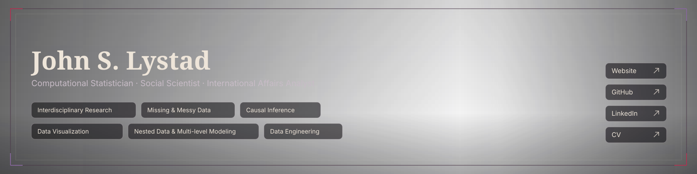

<p align="center">
  
</p>

<p align="center">
  <a href="https://lystadjs.github.io/"><strong>Website</strong></a>
  &nbsp;·&nbsp;
  <a href="https://lystadjs.github.io/research.html"><strong>Research</strong></a>
  &nbsp;·&nbsp;
  <a href="https://lystadjs.github.io/projects.html"><strong>Applied Projects</strong></a>
  &nbsp;·&nbsp;
  <a href="https://lystadjs.github.io/code.html"><strong>Code & Development</strong></a>
  &nbsp;·&nbsp;
  <a href="https://lystadjs.github.io/cv.html"><strong>CV</strong></a>
</p>

<p align="center">
  Computational statistics, social science, and technical development for consequential decisions under uncertainty.
</p>

---

### Current signal

```text
LystadJS@laboratory:~/Research$ ./current_signal --mode=humanitarian

[FIELD]   applied computational statistics
[CURRENT] open-source AI + autonomous weapon non-proliferation
[METHODS] R · Python · messy & missing data · causal inference
[CONTEXT] humanitarian crises · counterterrorism · deradicalization · human security
[MISSION] reduce uncertainty where analytical decisions affect people
```

I work at the intersection of **computational statistics**, **social science**, and **international policy**, with an emphasis on analytical methods that remain useful when information is incomplete, measurement is imperfect, and decisions carry real consequences.

> **Guiding principle:** Use what can be known to protect what can be lost.

### Three bodies of work

| Academic research | Applied projects | Code & development |
|---|---|---|
| Research questions, methodology, papers, works in progress, and the broader academic agenda. | Quantitative work supporting real-world operations, humanitarian response, policy, and decision support. | Reproducible analysis, statistical workflows, data engineering, software, automation, and technical notes. |
| [Research archive →](https://lystadjs.github.io/research.html) | [Project archive →](https://lystadjs.github.io/projects.html) | [Technical work →](https://lystadjs.github.io/code.html) |

### Methods & tooling

**Languages:** `R` · `Python` · `SQL` · `Rust`  
**Statistics:** regression · causal inference · model evaluation · messy & missing data  
**Data science:** unsupervised machine learning · data engineering · visualization · large-scale computing  
**Applied tooling:** GIS · OSINT · Azure · generative AI workflows  
**Development priorities:** reproducibility · auditability · research translation · automation

### Selected public work

- [`counterterrorism_ethnosectarian_islamic_state`](https://github.com/LystadJS/counterterrorism_ethnosectarian_islamic_state) — R-based data cleaning, transformation, and visualization workflows examining terrorism and ethnosectarian patterns in Iraq.
- [`UN-Transcript-Intelligence-Dynamic-Voting-Alignment`](https://github.com/LystadJS/UN-Transcript-Intelligence-Dynamic-Voting-Alignment) — public repository for work on UN transcript intelligence and dynamic voting alignment.
- [`Unsupervised-Machine-Learning`](https://github.com/LystadJS/Unsupervised-Machine-Learning) — material focused on unsupervised learning and discovering structure in unlabeled data.
- [`LystadJS.github.io`](https://github.com/LystadJS/LystadJS.github.io) — source for my academic and technical portfolio, including research, applied projects, technical work, and CV.
- [GitHub Gists](https://gist.github.com/LystadJS) — smaller utilities, reusable workflows, experiments, and code fragments.

### Research orientation

My current interests include:

- humanitarian crises and human security
- counterterrorism and deradicalization
- open-source artificial intelligence
- autonomous-weapon non-proliferation
- quantitative decision support under uncertainty

I am especially interested in work where **methodological rigor and technical implementation have to survive contact with imperfect real-world data**.

---

<p align="center">
  <a href="mailto:jl17842@nyu.edu">NYU Email</a>
  &nbsp;·&nbsp;
  <a href="mailto:lystadjs@gmail.com">Personal Email</a>
  &nbsp;·&nbsp;
  <a href="https://linkedin.com/LystadJS">LinkedIn</a>
  &nbsp;·&nbsp;
  <a href="https://github.com/LystadJS">GitHub</a>
</p>
