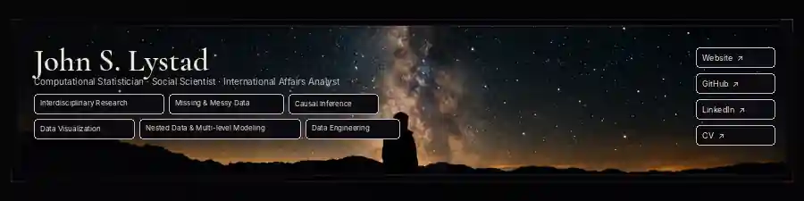

  

<map name="profile-banner-map">
  <area shape="rect" coords="38,105,183,127" href="https://github.com/LystadJS/counterterrorism_ethnosectarian_islamic_state" alt="Interdisciplinary Research">
  <area shape="rect" coords="189,105,317,127" href="https://github.com/LystadJS/counterterrorism_ethnosectarian_islamic_state" alt="Missing &amp; Messy Data">
  <area shape="rect" coords="323,105,423,127" href="https://github.com/LystadJS/APSTA-GE-2012-Causal-Inference" alt="Causal Inference">
  <area shape="rect" coords="38,133,150,155" href="https://github.com/LystadJS/LystadJS.github.io" alt="Data Visualization">
  <area shape="rect" coords="156,133,336,155" href="https://github.com/LystadJS/APSTA-GE-2042-Multilevel-Modeling-Nested-and-Longitudinal-Data" alt="Nested Data &amp; Multi-level Modeling">
  <area shape="rect" coords="342,133,447,155" href="https://github.com/LystadJS/counterterrorism_ethnosectarian_islamic_state" alt="Data Engineering">
  <area shape="rect" coords="779,53,867,75" href="https://lystadjs.github.io/" alt="Website">
  <area shape="rect" coords="779,82,867,104" href="https://github.com/LystadJS" alt="GitHub">
  <area shape="rect" coords="779,111,867,133" href="https://linkedin.com/LystadJS" alt="LinkedIn">
  <area shape="rect" coords="779,140,867,162" href="https://lystadjs.github.io/cv.html" alt="CV">
</map>

  
    Repositories:
    <a href="https://github.com/LystadJS/counterterrorism_ethnosectarian_islamic_state">Interdisciplinary Research</a>
    · <a href="https://github.com/LystadJS/counterterrorism_ethnosectarian_islamic_state">Missing &amp; Messy Data</a>
    · <a href="https://github.com/LystadJS/APSTA-GE-2012-Causal-Inference">Causal Inference</a>
    · <a href="https://github.com/LystadJS/LystadJS.github.io">Data Visualization</a>
    · <a href="https://github.com/LystadJS/APSTA-GE-2042-Multilevel-Modeling-Nested-and-Longitudinal-Data">Nested Data &amp; Multi-level Modeling</a>
    · <a href="https://github.com/LystadJS/counterterrorism_ethnosectarian_islamic_state">Data Engineering</a>
     
    Portfolio:
    <a href="https://lystadjs.github.io/">Website</a>
    · <a href="https://github.com/LystadJS">GitHub</a>
    · <a href="https://linkedin.com/LystadJS">LinkedIn</a>
    · <a href="https://lystadjs.github.io/cv.html">CV</a>
  

I work across **computational statistics, social science, and international policy**, building reproducible analytical workflows for problems where data are imperfect and decisions still carry consequences.

**Current focus:** open-source AI and autonomous-weapon non-proliferation, alongside continuing work on humanitarian crises, counterterrorism, deradicalization, and human security.

### Selected work

**[`counterterrorism_ethnosectarian_islamic_state`](https://github.com/LystadJS/counterterrorism_ethnosectarian_islamic_state)** · `active research`  
R workflows integrating terrorism event data with Iraqi spatial, ethnosectarian, and population data for reproducible analysis of Islamic State-linked attack patterns.

**[`LystadJS.github.io`](https://github.com/LystadJS/LystadJS.github.io)** · `portfolio infrastructure`  
Source for my academic and technical portfolio, research archive, project archive, code notes, and CV.

**[GitHub Gists](https://gist.github.com/LystadJS)** · `development toolkit`  
Smaller utilities, reusable workflows, experiments, and technical fragments.

### Methods

`R` · `Python` · `SQL` · `Rust` · causal inference · regression · messy & missing data · unsupervised learning · GIS · OSINT · data engineering · visualization · large-scale computing

I prioritize **reproducibility, auditability, and research translation**—especially where methodological rigor has to survive contact with imperfect real-world data.

  <a href="mailto:jl17842@nyu.edu">NYU Email</a>
  &nbsp;·&nbsp;
  <a href="mailto:lystadjs@gmail.com">Personal Email</a>
  &nbsp;·&nbsp;
  <a href="https://linkedin.com/LystadJS">LinkedIn</a>

