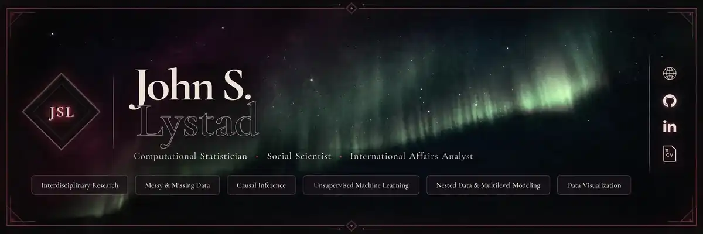

<!-- PROFILE BANNER START: stable raster composite; links rendered separately to avoid GitHub slice seams. -->
<p align="center">
  
</p>
<p align="center">
  <a href="https://lystadjs.github.io/"><strong>Website</strong></a>
  &nbsp;·&nbsp;
  <a href="https://github.com/LystadJS"><strong>GitHub</strong></a>
  &nbsp;·&nbsp;
  <a href="https://www.linkedin.com/in/lystadjs/"><strong>LinkedIn</strong></a>
  &nbsp;·&nbsp;
  <a href="https://lystadjs.github.io/cv.html"><strong>CV</strong></a>
</p>
<p align="center">
  <a href="https://github.com/LystadJS/counterterrorism_ethnosectarian_islamic_state">Interdisciplinary Research</a>
  &nbsp;·&nbsp;
  <a href="https://github.com/LystadJS/method-missing-data">Messy &amp; Missing Data</a>
  &nbsp;·&nbsp;
  <a href="https://github.com/LystadJS/APSTA-GE-2012-Causal-Inference">Causal Inference</a>
  &nbsp;·&nbsp;
  <a href="https://github.com/LystadJS/Unsupervised-Machine-Learning">Unsupervised Machine Learning</a>
  &nbsp;·&nbsp;
  <a href="https://github.com/LystadJS/method-longitudinal-multilevel">Nested Data &amp; Multilevel Modeling</a>
  &nbsp;·&nbsp;
  <a href="https://github.com/LystadJS/method-statistical-computing">Data Visualization</a>
</p>
<!-- PROFILE BANNER END -->

---

I build **reproducible statistical and computational workflows** for social-science and international-affairs problems where data are incomplete, heterogeneous, difficult to integrate, or operationally consequential.

My work sits at the intersection of **computational statistics, empirical social science, research engineering, and international affairs**, with particular interests in political violence, human security, AI governance, and translating complex evidence into defensible analytical conclusions.

> **WORKING STANDARD //** reproducibility · auditability · explicit uncertainty · research translation

## 01 // Selected Work

### Unsupervised Machine Learning

`ACTIVE METHODS REFERENCE`  
`R` · `clustering` · `dimension reduction` · `exploratory analysis` · `reproducible learning`

A growing technical reference for unsupervised-learning methods, with emphasis on exploratory structure discovery, dimensionality reduction, clustering, and statistically interpretable workflows.

[Repository →](https://github.com/LystadJS/Unsupervised-Machine-Learning)

---

### Political Violence, Ethnosectarian Context & Islamic State Attack Patterns

`ACTIVE RESEARCH`  
`R` · `GIS` · `spatial data` · `missing & messy data` · `population weighting`

Reproducible analytical workflows integrating terrorism-event data with Iraqi spatial, ethnosectarian, and population data. The project emphasizes data provenance, spatial validation, missingness diagnostics, reconstructable transformations, and publication-oriented analysis.

[Repository →](https://github.com/LystadJS/counterterrorism_ethnosectarian_islamic_state) · [Research context →](https://lystadjs.github.io/research.html)

---

### Artificial Intelligence Governance & Non-Proliferation

`ACTIVE APPLIED RESEARCH`  
`R` · `PCoA` · `mixed-data distance` · `multilateral governance` · `reproducible visualization`

A sanitized public reproducibility layer for analysis of AI-governance institutional terrain across the United Nations and wider multilateral ecosystem. The public release reproduces the structured Gower-distance and principal-coordinates workflow, numerical diagnostics, and publication-style strategic-terrain visualization while keeping private evidence archives and working materials separate.

[Repository →](https://github.com/LystadJS/project-ai-governance-non-proliferation) · [Research context →](https://lystadjs.github.io/research.html#project-ai-nonproliferation)

---

### Academic & Technical Portfolio

`ACTIVE`  
`HTML` · `CSS` · `JavaScript` · `GitHub Pages` · `technical communication`

Source for my public research and technical portfolio, including research, applied projects, code and development work, technical notes, and curriculum vitae. The site is intentionally dependency-light and points outward to the underlying reproducible artifacts rather than duplicating project documentation.

[Repository →](https://github.com/LystadJS/LystadJS.github.io) · [Live site →](https://lystadjs.github.io/)

## 02 // Methods

**METHOD HUBS**  
[Unsupervised Learning](https://github.com/LystadJS/Unsupervised-Machine-Learning) · [Cluster Analysis](https://github.com/LystadJS/method-clustering) · [Dimension Reduction](https://github.com/LystadJS/method-dimension-reduction) · [Network Analysis](https://github.com/LystadJS/method-network-analysis) · [Missing Data & Measurement](https://github.com/LystadJS/method-missing-data) · [Longitudinal & Multilevel](https://github.com/LystadJS/method-longitudinal-multilevel) · [Spatial Statistics](https://github.com/LystadJS/method-spatial-statistics) · [Statistical Computing & Visualization](https://github.com/LystadJS/method-statistical-computing)

**STATISTICAL + COMPUTATIONAL**  
`causal inference` · `regression` · `multilevel & nested-data models` · `missing-data methods` · `unsupervised learning`

**RESEARCH + DATA ENGINEERING**  
`reproducible pipelines` · `validation & diagnostics` · `provenance & auditability` · `data integration` · `structured research workflows`

**APPLIED ANALYSIS**  
`GIS & spatial analysis` · `OSINT` · `visualization` · `interdisciplinary research` · `human-security analysis`

**LANGUAGES + SYSTEMS**  
`R` · `Python` · `SQL` · `Rust` · `shell / CLI workflows`

I generally prefer workflows in which analytical decisions can be **inspected, reconstructed, challenged, and rerun** rather than hidden behind a final figure or model object.

## 03 // Current

> `CURRENT // SEP 2026`  
> **AI GOVERNANCE** — open-source AI and autonomous-weapon non-proliferation  
> **INTERNATIONAL INSTITUTIONS** — UN transcript intelligence and dynamic voting alignment  
> **POLITICAL VIOLENCE & HUMAN SECURITY** — counterterrorism, deradicalization, humanitarian crises, ethnosectarian dynamics, and conflict analysis

**Active development:** [UN transcript intelligence & dynamic voting alignment](https://github.com/LystadJS/UN-Transcript-Intelligence-Dynamic-Voting-Alignment) — public project shell for ongoing work concerning United Nations transcript intelligence and changing voting alignment. Substantive methodology, implementation, and empirical results should not be inferred until they are published in the repository.

## 04 // Research & Technical Infrastructure

**Research domains** — [Political Violence](https://github.com/LystadJS/domain-political-violence) · [Terrorism & Counterterrorism](https://github.com/LystadJS/domain-terrorism-counterterrorism) · [Humanitarian Response](https://github.com/LystadJS/domain-humanitarian-response) · [Human Security](https://github.com/LystadJS/domain-human-security) · [Emerging Technology](https://github.com/LystadJS/domain-emerging-technology) · [Anthropocene & Human Ecology](https://github.com/LystadJS/domain-anthropocene-human-ecology)

**Portfolio** — [Website](https://lystadjs.github.io/) · [Research](https://lystadjs.github.io/research.html) · [CV](https://lystadjs.github.io/cv.html)

**Technical** — [Code & Development](https://lystadjs.github.io/code.html) · [Research Registry](https://github.com/LystadJS/research-registry) · [Development Toolkit / Gists](https://gist.github.com/LystadJS)

<details>
<summary><strong>05 // Repository Standard</strong> — reproducibility, provenance, and research-integrity conventions</summary>

<br>

Public research repositories are intended to make the analytical process legible, not merely display final outputs.

Where appropriate, projects document:

- research questions and analytical scope;
- source-data provenance and redistribution constraints;
- schema, duplicate, missingness, and validation checks;
- canonical analytical entry points;
- reproducibility requirements and deterministic settings;
- model and figure provenance;
- citation guidance;
- rights and reuse considerations; and
- the distinction between exploratory, active, and publication-ready results.

```text
source material
      ↓
validation + provenance
      ↓
cleaning + transformation
      ↓
analytical dataset
      ↓
models / diagnostics / figures
      ↓
interpretation
      ↓
versioned research artifact
```

</details>

---

<p align="center">
  <a href="https://lystadjs.github.io/">Website</a>
  &nbsp;·&nbsp;
  <a href="https://lystadjs.github.io/cv.html">CV</a>
  &nbsp;·&nbsp;
  <a href="https://www.linkedin.com/in/lystadjs/">LinkedIn</a>
</p>